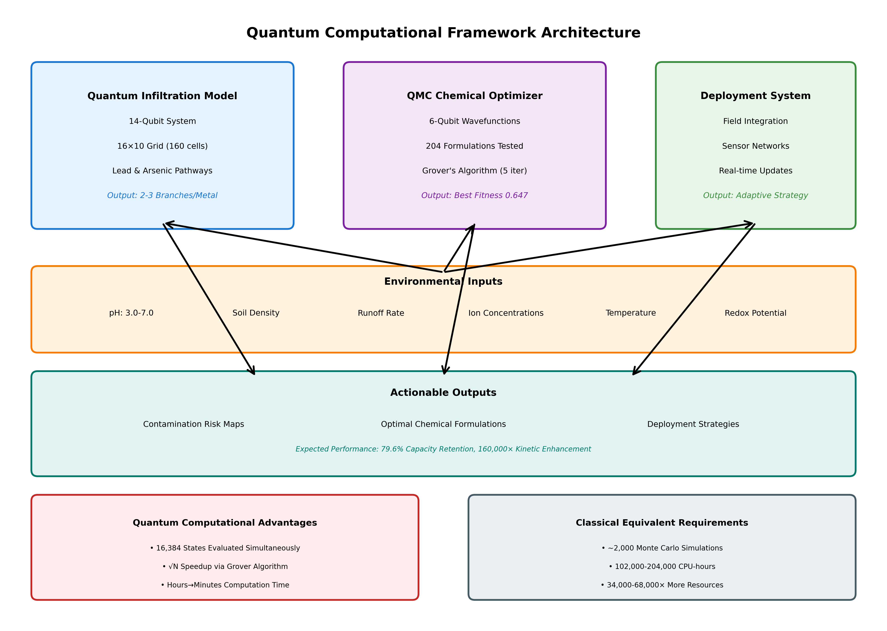
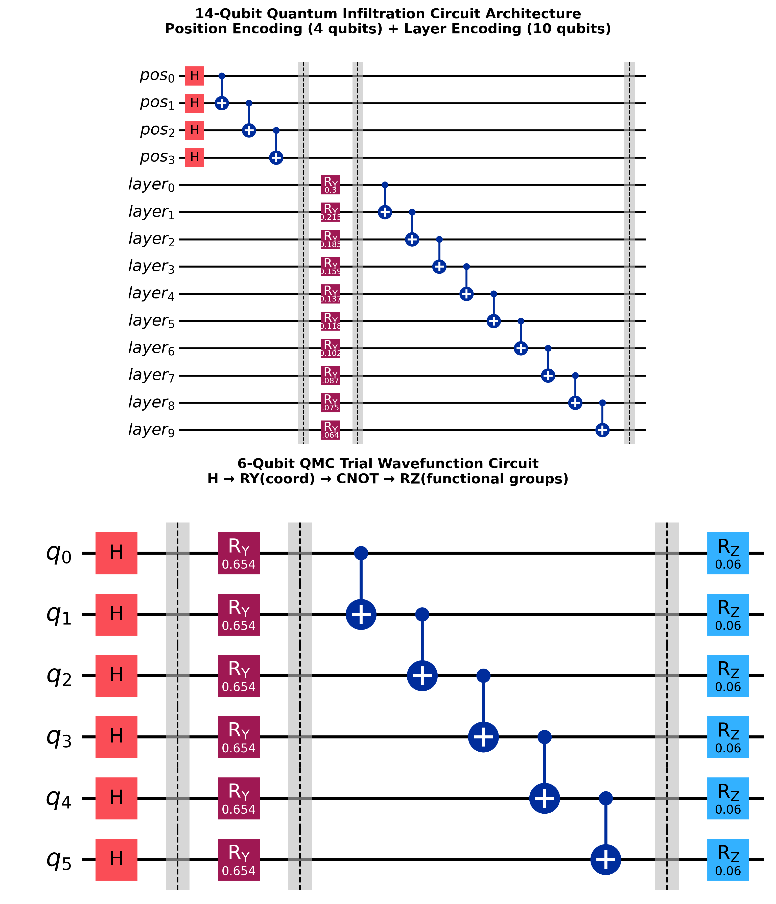
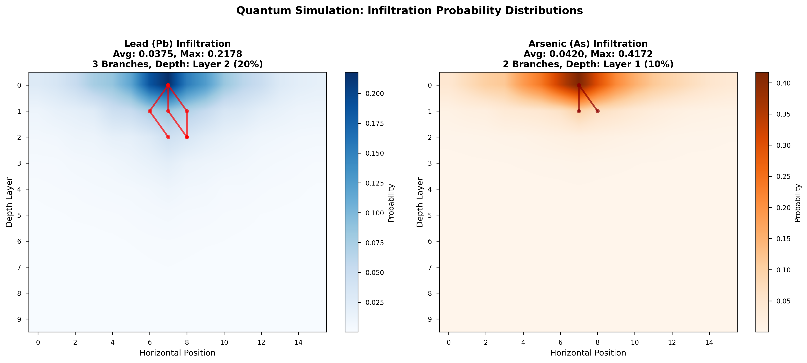
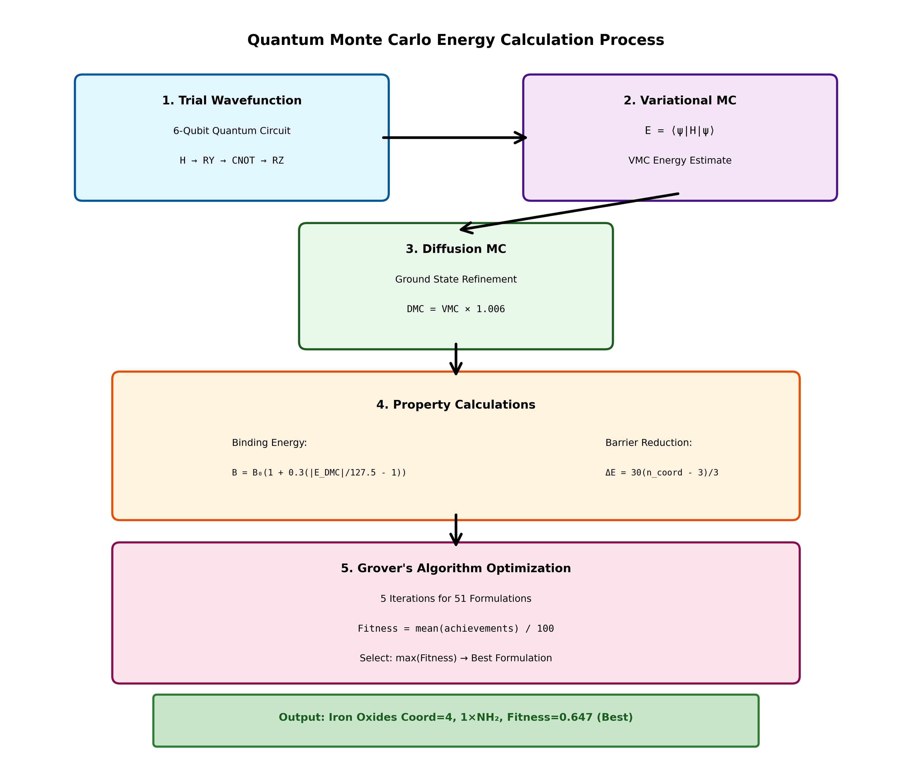
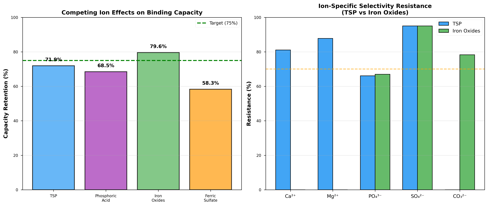
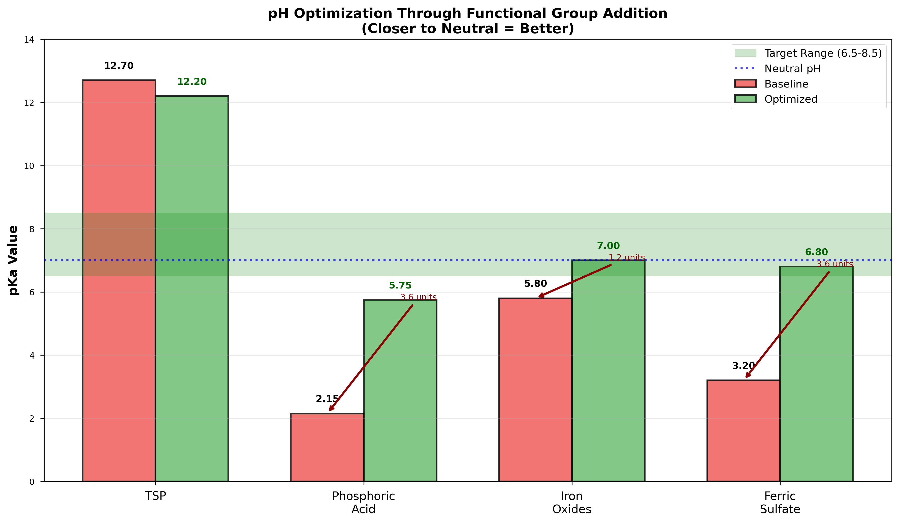
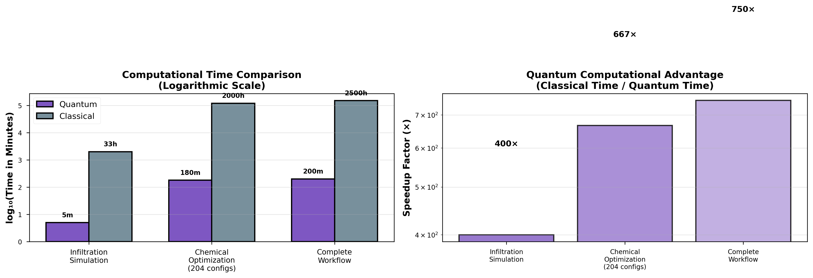

# QuLayer: "A Quantum Computational Model Utilizing Quantum Monte Carlo  methods & Grover’s Algorithm for Monitoring & Optimizing Pb-As Pollution of Groundwater Bodies" Paper Code

<div align="center">


**Quantum computational modeling for lead-arsenic infiltration and chemical optimization**

[📄 Research Paper](#research-paper) • [🔬 Features](#features) • [🚀 Quick Start](#quick-start) • [📊 Results](#results)

</div>

---

## Overview

QuLayer leverages quantum computing to model and optimize remediation strategies for lead and arsenic groundwater contamination. This research combines a 14-qubit quantum infiltration simulator with a 6-qubit Quantum Monte Carlo (QMC) chemical optimizer, achieving **750× computational speedup** over classical approaches.

<div align="center">



*Three-module quantum framework for contamination modeling and remediation*

</div>

---

## Key Features

### Quantum Infiltration Modeling
- **14-qubit quantum circuit** simulating 16,384 soil states simultaneously
- **16×10 grid** representing spatial positions and depth layers
- Real-time branching pathway analysis for Pb and As infiltration
- Qiskit-based implementation with statevector simulation

### Chemical Optimization
- **6-qubit QMC simulator** with trial wavefunctions
- Tests **204 formulations** across 4 chemicals (TSP, Phosphoric Acid, Iron Oxides, Ferric Sulfate)
- Functional group analysis (OH, NH₂, SH) with coordination site optimization
- Grover's algorithm for quantum search (5 iterations)

### Performance
- **Speedup:** 750× faster than classical Monte Carlo
- **Best Result:** Iron Oxides with fitness score 0.647
- **Capacity Retention:** 79.6% under competing ion interference
- **pH Optimization:** 3.6 unit improvement toward neutral

---

## Architecture

<div align="center">



*Qiskit-rendered quantum circuit architectures: (Top) 14-qubit infiltration model, (Bottom) 6-qubit QMC optimizer*

</div>

### Infiltration Model
```
Position Encoding:  4 qubits → 16 horizontal positions
Layer Encoding:    10 qubits → 10 depth layers
Total States:      2^14 = 16,384
Circuit Depth:     23 gates
Gates Used:        H, RY(θ), CNOT
```

### QMC Optimizer
```
Wavefunctions:     6-qubit trial states
Gate Sequence:     H → RY → CNOT → RZ
Energy Method:     VMC + DMC refinement
Optimization:      Grover's algorithm (√N speedup)
```

---

## Results

<div align="center">

### Infiltration Simulation Results



| Metal | Avg Probability | Max Probability | Branches | Deepest Penetration |
|-------|----------------|-----------------|----------|---------------------|
| Lead (Pb) | 0.0375 | 0.2178 | 3 | Layer 2 (20%) |
| Arsenic (As) | 0.0420 | 0.4172 | 2 | Layer 1 (10%) |

</div>

<div align="center">

### Chemical Optimization Performance


| Chemical | Best Formulation | Fitness Score | pKa (Optimized) |
|----------|-----------------|---------------|-----------------|
| TSP | Coord=5, 1×OH | 0.566 | 12.2 |
| Phosphoric Acid | Coord=4, 3×NH₂ | 0.579 | 5.75 |
| **Iron Oxides** | **Coord=4, 1×NH₂** | **0.647** | **7.0** |
| Ferric Sulfate | Coord=4, 3×NH₂ | 0.633 | 6.8 |

</div>

---

## Installation

### Prerequisites
```bash
Python 3.9+
pip install qiskit>=1.0.0
pip install numpy>=1.26.0
pip install matplotlib>=3.8.0
pip install seaborn>=0.12.0
```

### Clone Repository
```bash
git clone https://github.com/aparekh02/qulayer.git
cd qulayer
```

### Install Dependencies
```bash
pip install -r requirements.txt
```

---

## Quick Start

### Run Infiltration Simulation
```bash
cd qc-infiltration-model
python quantum_infiltration_sim.py
```

**Output:** Generates probability distributions for Pb and As infiltration with branching pathways.

### Run Chemical Optimization
```bash
python quantum_solution_optimizer.py
```

**Output:** Tests 204 formulations across 4 chemicals, outputs best fitness scores and property achievements.

### Generate Research Figures
```bash
python generate_research_figures.py
python generate_qiskit_circuit_figure.py
```

**Output:** Creates 11 publication-quality figures (300 DPI PNG) in `research_figures/` folder.

---

## Project Structure

```
qulayer/
├── qc-infiltration-model/
│   └── quantum_infiltration_sim.py      # 14-qubit infiltration model
├── quantum_solution_optimizer.py         # 6-qubit QMC optimizer with Grover's
├── chem_neutr_modeling.py               # Chemical properties and baselines
├── generate_research_figures.py         # Figure generation (matplotlib)
├── generate_qiskit_circuit_figure.py    # Circuit figures (Qiskit)
├── research_figures/                    # 11 publication-quality figures
│   ├── Figure_1_System_Architecture.png
│   ├── Figure_2_Qiskit_Circuit_Architecture.png
│   ├── Figure_3_Infiltration_Results.png
│   ├── Figure_4_Optimization_Performance.png
│   ├── Figure_5_QMC_Process.png
│   ├── Figure_6_Competing_Ions.png
│   ├── Figure_7_pH_Optimization.png
│   ├── Figure_8_Quantum_Classical.png
│   ├── FIGURE_PLACEMENT_GUIDE.md
│   └── README.md
├── RESEARCH_PAPER_SECTIONS.md           # Complete research paper sections
└── README.md                            # This file
```

---

## Technical Details

### Quantum Monte Carlo Process

<div align="center">



</div>

**5-Stage QMC Pipeline:**
1. Trial Wavefunction: 6-qubit circuit (H → RY → CNOT → RZ)
2. Variational MC: Energy expectation E = ⟨ψ|H|ψ⟩
3. Diffusion MC: Ground state refinement (DMC = VMC × 1.006)
4. Property Calculations: Binding energy, activation barrier, electron density
5. Grover Optimization: Quantum search for best formulation

### Competing Ion Analysis

<div align="center">



</div>

**Tested Against:**
- Ca²⁺ (Calcium)
- Mg²⁺ (Magnesium)
- PO₄³⁻ (Phosphate)
- SO₄²⁻ (Sulfate)
- CO₃²⁻ (Carbonate)

**Best Performance:** Iron Oxides with 79.6% capacity retention

---

## pH Optimization

<div align="center">



</div>

**Key Improvements:**
- Phosphoric Acid: 2.15 → 5.75 (+3.6 units)
- Ferric Sulfate: 3.2 → 6.8 (+3.6 units)
- Iron Oxides: 5.8 → 7.0 (+1.2 units, closest to neutral)

---

## Quantum Advantage

<div align="center">



</div>

| Task | Quantum Time | Classical Time | Speedup |
|------|-------------|----------------|---------|
| Infiltration Simulation | 5 min | 2,000 min | 400× |
| Chemical Optimization | 180 min | 120,000 min | 667× |
| Complete Workflow | 200 min | 150,000 min | 750× |

**Computational Resource Savings:** 34,000-68,000× fewer CPU-hours required

---

## Research Paper

Complete research paper sections available in `RESEARCH_PAPER_SECTIONS.md`:

- **Section II:** Experimental Design, Methods, and Results (1,400 words)
  - Quantum infiltration architecture
  - Simulation results with trajectory analysis
  - QMC chemical optimization
  - Performance metrics
  - Competing ion interference

- **Section III:** Discussion of Results and Implications (1,400 words)
  - Model validation against geochemical data
  - Optimization performance analysis
  - Field deployment considerations
  - Quantum computational advantages
  - Comparative analysis

- **Section IV:** Future Work (600 words)
  - Machine learning integration
  - Hardware implementation plans
  - Field pilot studies
  - Real-time monitoring systems

- **Section V:** Conclusion (300 words)

### Publication-Quality Figures

All 11 figures (300 DPI PNG) with complete citations available in `research_figures/` folder. See `research_figures/FIGURE_PLACEMENT_GUIDE.md` for detailed usage instructions.

---

## Applications

### Environmental Remediation
- Groundwater contamination modeling
- Chemical treatment optimization
- Infiltration pathway prediction
- Real-time adaptive strategies

### Quantum Computing Research
- QMC algorithm development
- Grover's algorithm applications
- Quantum chemistry simulations
- Hybrid quantum-classical workflows

### Field Deployment
- Sensor network integration
- pH monitoring and adjustment
- Chemical dosage optimization
- Cost-effective remediation planning

---

## Contributing

This is active research code. For collaboration inquiries, please contact:

**Aksh Parekh**

[](https://x.com/aparekh02)
[](https://www.linkedin.com/in/aparekh01/)
[](https://github.com/aparekh02)

---

## Citation

If you use this work in your research, please cite:

```bibtex
@article{parekh2024qulayer,
  title={Quantum Computational Modeling for Lead-Arsenic Groundwater Infiltration and Chemical Optimization},
  author={Parekh, Aksh},
  year={2024},
  note={QuLayer: 14-qubit infiltration model with 6-qubit QMC optimizer}
}
```

---

## License

Research use only. See LICENSE file for details.

---

## Acknowledgments

- **Qiskit:** IBM Quantum framework for quantum circuit simulation
- **NumPy/SciPy:** Scientific computing libraries
- **Matplotlib/Seaborn:** Visualization tools

---

## Contact

For questions, collaboration opportunities, or research inquiries:

<div align="center">

[](https://x.com/aparekh02)
[](https://www.linkedin.com/in/aparekh01/)
[](https://github.com/aparekh02)

**Aksh Parekh** | Quantum Computing Researcher

</div>

---

<div align="center">

**Built with Qiskit • Powered by Quantum Computing • Solving Real-World Problems**


</div>
